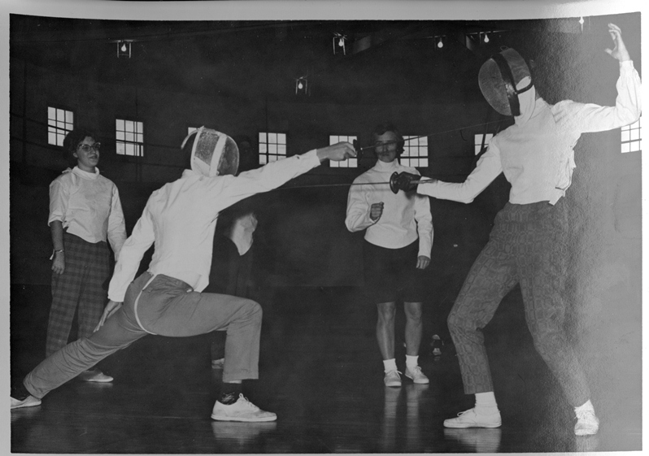
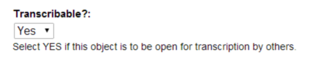
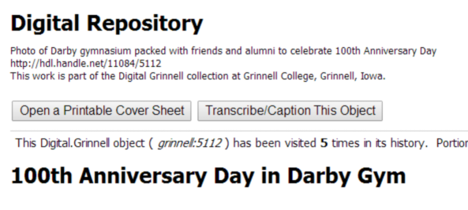
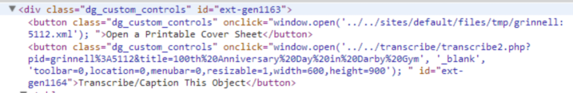
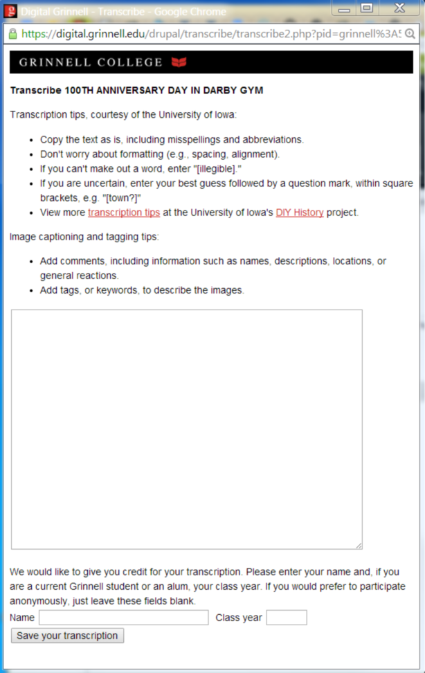

# Transcription in Digital Grinnell #

The origin and intended purpose for transcription and captioning features within Digital Grinnell (DG) are described in this cover story which first appeared on the DG home page in April 2014.
##
**Transcription and Caption Innovation Fund Project**

 
> Who was that masked man?  Only you can help us identify the people and events in the College's photograph archives.  All you have to do is visit Digital Grinnell ([http://digital.grinnell.edu](http://digital.grinnell.edu)) and click on the Transcribable or Captionable Objects link.  This will bring up a list of all of the objects in the collection, from which you can choose a photo and tell us the story behind the image. 
> 
> This enhancement to Digital Grinnell was made possible through a grant from the Innovation Fund, which encourages innovative ways of teaching and learning. As more and more classes incorporate primary resources into their curricula, photographs, letters, diaries, and other records of first-hand experiences become more and more valuable.  By contributing to the transcribing and captioning of the documents in Digital Grinnell, you are adding to the context and enhancing the understanding of Grinnell’s rich history for future generations of Grinnellians. 
> 
> We will be releasing other collections with the transcription/captioning feature in the next few months – stay tuned for news!
##

Key players in transcription and captioning development include Grinnell College librarians and staff members Julia Bauder, Becky Yoose, Christopher Jones and Mark McFate.  Their work is based on a collection of tools and technologies including the University of Iowa Libraries’ “DIY History” project and MediaWiki.  Links to these, and related resources, are provided below.

- [http://www.mediawiki.org](http://www.mediawiki.org)
- [https://github.com/wikimedia/mediawiki-tools-release/blob/master/make-deploy-notes/botclasses.php](https://github.com/wikimedia/mediawiki-tools-release/blob/master/make-deploy-notes/botclasses.php) 
- [http://www.mediawiki.org/wiki/Extension:Pdf_Export](http://www.mediawiki.org/wiki/Extension:Pdf_Export)
- [http://diyhistory.lib.uiowa.edu/about.php#tips](http://diyhistory.lib.uiowa.edu/about.php#tips)

# How DG’s Transcription Feature Works #

**Note**: Throughout this section you will find references (in ***bold italic*** print) to corresponding source code and related digital resources.  All such resources are available in the Grinnell College Library Git repository and the Digital-Grinnell-Transcription project at Github ([https://github.com/GrinnellCollegeLibraries/Digital-Grinnell-Transcription](https://github.com/GrinnellCollegeLibraries/Digital-Grinnell-Transcription)).

The transcriptions are stored in Mediawiki. Communication between Mediawiki and the user interface is handled by ***botclasses.php*** ([http://www.mediawiki.org/wiki/Manual:Chris_G's_botclasses](http://www.mediawiki.org/wiki/Manual:Chris_G's_botclasses)). 

#Installation#
Mediawiki is installed and configured as normal, following the instructions in the Mediawiki documentation: [http://www.mediawiki.org/wiki/Manual:Installation_guide](http://www.mediawiki.org/wiki/Manual:Installation_guide).

Once Mediawiki is installed, log in as an administrator and create a bot user with, at minimum, “read,” “edit,” and “createpage” permissions ([http://www.mediawiki.org/wiki/Manual:User_rights](http://www.mediawiki.org/wiki/Manual:User_rights)). Note the username and password for this user and enter them into ***transcribe2.php***, line 17, and ***submit.php***, line 7. You may at this time also wish to lock down Mediawiki so that no one but this bot and your administrators can view or edit pages.

If you would like to enable the optional statistics-tracking feature, set up a database of your choice, edit ***submit.php***, line 31, to point to the location of your ***statspost.php*** file, and edit ***statspost.php***, line 3, to enter the database name and login credentials for the database you set up. If you do not want to enable statistics-tracking, comment out lines 31-44 of ***submit.php***.

# Enabling Transcription #
The transcription process begins when a new object is ingested, or whenever the metadata (MODS record) of an existing object is edited, and transcription is enabled.  A copy of the MODS form, exported as XML from the Islandora Forms Editor, is included in the repository as ***DG Full MODS Form (Feb-18-2014).xml***.  The “transcription” element in this form presents a simple Yes|No selection box which generally looks something like this:
 

Specifying “Yes” and submitting the form inserts a <relatedItem> and child <identifier> element, like the following, into the MODS record:

    <relatedItem displayLabel="Transcribe This Item" type="constituent">
    <identifier type="uri">/transcribe/transcribe2.php?pid=grinnell%3A3279&amp;title=1110%20Main%20Street</identifier>
    </relatedItem>

This element in MODS is used to enable transcription features during the life of the corresponding object, and these records are also transformed into corresponding Dublin Core (DC) records of the form:

    <dc:relation>/transcribe/transcribe2.php?pid=grinnell%3A3279&amp;title=1110%20Main%20Street--</dc:relation>

The transform of MODS to DC is governed by portions of the XSLT found in /var/www/drupal-6.28/sites/all/modules/contrib/islandora_content_model_forms/transforms/***mods_to_dc_grinnell.xsl***.

Note that in each of these records the persistent identifier (PID) and title of the object are preserved to link subsequent transcriptions back to the parent object.  Also note that the value of the MODS ‘identifer’ element is a link to the PHP code used to control the object’s transcription, namely ‘/transcribe/***transcribe2.php***’. Objects which do not carry these records are, by default, not open for transcription.

# Searching for Transcribable Objects #
Facet search:  a link can be appended to the bottom of the “Islandora Facet Block” and styled to match other search facet links. The link structure should be http://yourislandorasite.edu/pathtosolr/search/dc.relation%3A%28transcribe%29 which should return all objects which carry a DC record of the form documented above.
   
**Warning!**  
> Be advised that in its earliest implementation the transcription feature used slightly different MODS and DC record syntax, such that records were present even in objects which were not enabled for transcription.  Steps were taken in January 2014 to remove all of these old transcription records and replace them with the new syntax.  However, the responsible batch process may have omitted some objects which were ‘inactive’ at that time.  If a search/link like the one presented above returns an object which is not enabled for transcription, it’s likely to indicate that the object was ingested before the syntax change and was omitted during the batch conversion.  Users with sufficient privilege can correct such objects simply by opening the corresponding MODS record in the Islandora Form Editor and saving that record without making any changes.  This step should trigger a new MODS-to-DC transform and effectively remove the errant DC which caused the object to return in the search.  Objects ingested after the January 2014 syntax change are not impacted by this issue.

# Transcribing an Object #
When object transcription is enabled, an object’s repository page, [https://digital.grinnell.edu/drupal/fedora/repository/grinnell%3A5112](https://digital.grinnell.edu/drupal/fedora/repository/grinnell%3A5112), for example, includes a “Transcribe/Caption This Object” button/link like the one shown below.

 
The corresponding markup for this button, and more, is shown below as part of a “dg_custom_controls” div which is added to all repository pages.  Note that the argument passed to window.open( ) is the contents of the MODS <identifier> and <dc:relation> elements discussed earlier. 

Source code to implement this button currently resides in ***template.php*** as well as the “dg_custom_controls” function within ***dg_utilities.module***. 

Clicking the button opens a pop-up window like the one shown below.  This pop-up will display any relevant transcription that was previously added to the target object, and provides a space for the user to enter text along with spaces to optionally provide their name and Grinnell College graduation year.  This information, if provided, is appended to any descriptive text they provide.
  
The name and class year, along with the PID of the object transcribed and a timestamp, are also stored in a MySQL database for statistical purposes.

 
Transcription processing is handled by PHP code (some modified from MediaWiki) which currently resides in /var/www/transcribe/***botclasses.php***, ***submit.php***, and ***transcribe2.php***.

# Working with Transcriptions-in-Progress and Completed Transcriptions #
Since the transcriptions are stored in Mediawiki, administrators have access to all of Mediawiki’s optional functions, such as e-mail notifications of new or updated transcriptions and revision histories for transcriptions. See the Mediawiki documentation ([http://www.mediawiki.org/wiki](http://www.mediawiki.org/wiki)) for more information about these workflow-facilitating features.
 
With the addition of a PDF export extension ([http://www.mediawiki.org/wiki/Extension:Pdf_Export](http://www.mediawiki.org/wiki/Extension:Pdf_Export)) users can have the ability to export completed transcriptions as PDFs for ingestion into Islandora or another system that provides full-text searching of the transcriptions. Since the transcriptions-in-progress are stored in Mediawiki, outside of the repository system, they are not searchable by end-users of the repository until they are exported from Mediawiki and ingested into the repository system. (This may be a feature or a bug, depending on your perspective.)

#License#
[GPLv3](https://www.gnu.org/licenses/gpl-3.0.txt)

